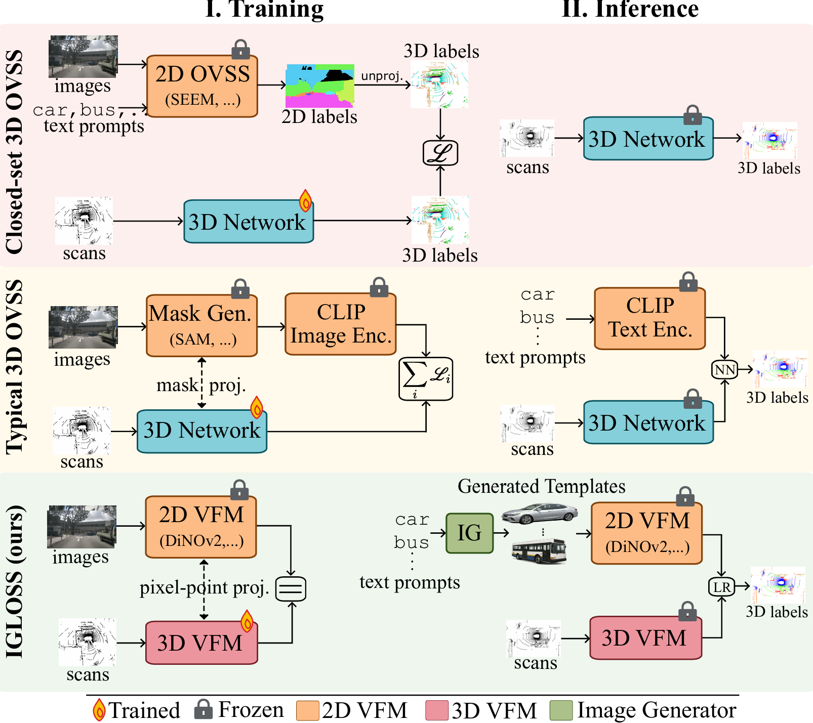

<h1 align="center"> IGLOSS: Image Generation for Lidar Open-vocabulary Semantic Segmentation
</h1>

<p align="center">
  <a href="https://nerminsamet.github.io/" target="_blank">Nermin&nbsp;Samet</a> &ensp; <b>&middot;</b> &ensp;
  <a href="https://sites.google.com/site/puygilles/" 
  target="_blank">Gilles&nbsp;Puy</a> &ensp; <b>&middot;</b> &ensp;
  <a href="https://imagine.enpc.fr/~marletr/" target="_blank">Renaud&nbsp;Marlet</a>&ensp;
</p>

<p align="center">
  Valeo.ai, Paris, France &emsp; </sub>
</p>

<p align="center">
  <!-- <a href="">🌐 Project Page</a> &ensp; -->
  <a href="https://arxiv.org/abs/2604.01361">📃 Paper</a> &ensp;
</p>


<p align="center">
  
</p>

## ✨ What's IGLOSS?

Open-vocabulary perception in 3D is still far behind 2D vision, largely because transferring semantic knowledge from vision-language models to LiDAR data is not straightforward.

Instead of relying only on image-text alignment, IGLOSS uses **text-to-image generation** to create **prototype images** for target classes. These prototypes act as a visual semantic bridge between language and LiDAR. Combined with a **3D network distilled from a 2D vision foundation model**, our method labels points by matching **3D point features** with **2D prototype image features**.

Some highlights:

• State-of-the-art open-vocabulary semantic segmentation on both nuScenes and SemanticKITTI

• State-of-the-art annotation-free closed-set segmentation on both datasets as well

• A simple framework built from three ingredients: image generation, a strong 2D VFM, and an aligned 3D VFM

• No need for direct image-text alignment, heavy prompt engineering, images at test time, or scan sequences at test time

• Opens new perspectives for research at the intersection of **3D scene understanding**, **foundation models**, and **generative methods**.
 

## Citation

If you find IGLOSS useful for your research, please cite our paper as follows.

> N. Samet, G. Puy, R. Marlet, "IGLOSS: Image Generation for Lidar Open-vocabulary Semantic Segmentation",
> arXiv, 2026.


BibTeX entry:
```
@inproceedings{igloss,
  author = {Nermin Samet and Gilles Puy and Renaud Marlet},
  title = {IGLOSS: Image Generation for Lidar Open-vocabulary Semantic Segmentation},
  booktitle = {arXiv},
  year = {2026},
}
```

## Installation

Please follow the [ScaLR installation instructions](https://github.com/valeoai/ScaLR) to set up the required environment.
Also, please install any other required packages as needed via pip during the setup process.

## Zero-shot Semantic Segmentation of Lidar Scenes with IGLOSS
 
Ensure the **ScaLR+ pretrained backbone weights** are [downloaded](https://github.com/valeoai/IGLOSS/releases/download/v0.1.0/WI_768_droppath_gelu-dinov2_vitl-448x896-mlp_2048-65_epoch-checkpointing.tar), unpacked, and placed under the `checkpoints/` folder.

Set your project directory path:

```bash
export PROJECT_PATH="path/to/IGLOSS"
```


**1. Extract template features**

Using DINOv2, extract the template features by running:

```bash
./PROJECT_PATH/open_voc_segmentation/image_feature_extraction.sh
```

**2. Segment LiDAR scenes**

Once features are extracted, run open-vocabulary segmentation with IGLOSS:

```bash
./PROJECT_PATH/open_voc_segmentation/open_voc_segmentation_w_igloss.sh
```

By default, the script runs on **nuScenes**. Settings for **SemanticKITTI** are also provided within the script.


## 2D-to-3D Distillation with ScaLR+


In order to distill this model, run the following distillation script:

```bash
./PROJECT_PATH/scripts/WI_768_droppath_gelu-dinov2_vitl-448x896-mlp_2048-65_epoch-checkpointing.sh
```

> **Note:** For more on ScaLR+ (finetuning, downstream evaluation etc.), please refer to the [ScaLR repository](https://github.com/valeoai/ScaLR).


 
